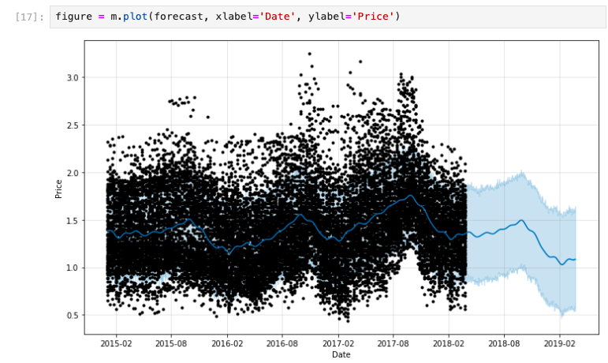
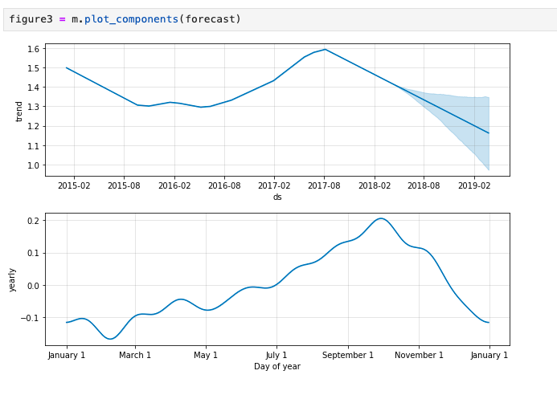

##  Results
- Prophet was able to capture seasonality and trends in avocado prices.
- Here are sample outputs from the forecasting step:
 

- Black dots → actual avocado prices from the dataset (historical data up to 2018).
- Blue line → Prophet’s forecasted values.
- Light blue shaded area → uncertainty interval (confidence range).
- Since the dataset ends in 2018, everything after that date is purely the model’s prediction rather than real observations.

 

 - Trend – the long-term direction of avocado prices.
- Y-axis: trend (price level)
- X-axis: ds (time in years)
- Yearly Seasonality – repeating patterns within a year.
- Y-axis: effect of seasonality on price.
- X-axis: day of year (January → December).
This shows when prices typically rise (e.g., summer) and when they fall (e.g., winter).

# 🥑 Predicting Avocado Prices Using Facebook Prophet

- This project forecasts weekly retail avocado prices using Facebook Prophet.
- The dataset contains 2018 weekly retail scan data for Hass avocados, collected from retailers’ cash registers across the United States.
  
##  Dataset Description

- The dataset only includes Hass avocados (no greenskins).
- The Average Price is per avocado unit, even if sold in bags.
  
## Key Columns:
- Date – Date of observation
- AveragePrice – Average price of a single avocado
- Type – Conventional or organic
- Year – Year of observation
- Region – City or region of observation
- Total Volume – Total avocados sold
- 4046, 4225, 4770 – Volume by PLU codes
  
##  Tools & Libraries

- Pandas – data processing
- NumPy – numerical analysis
- Matplotlib – visualizations
- Seaborn – statistical plots
- Facebook Prophet – forecasting
  
##  Workflow

- Importing Libraries
- Exploring the Dataset – Checking structure, missing values, and basic statistics.
- Preprocessing – Converting dates, aggregating sales, filtering by type/region.
- Visualization – Price trends, organic vs conventional, regional comparisons.
- Forecasting with Prophet – Training and predicting future prices.
- Evaluation – Comparing predicted vs actual prices.

